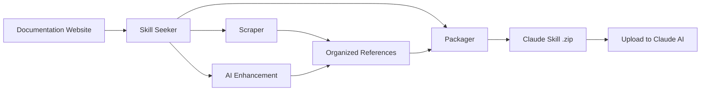

[](https://mseep.ai/app/yusufkaraaslan-skill-seekers)

# Skill Seeker

[](https://github.com/yusufkaraaslan/Skill_Seekers/releases/tag/v2.0.0)
[](https://opensource.org/licenses/MIT)
[](https://www.python.org/downloads/)
[](https://modelcontextprotocol.io)
[](tests/)
[](https://github.com/users/yusufkaraaslan/projects/2)
[](https://pypi.org/project/skill-seekers/)
[](https://pypi.org/project/skill-seekers/)
[](https://pypi.org/project/skill-seekers/)

**数分钟内即可把文档站点、GitHub 仓库与 PDF 自动转成可直接上传 Claude 的 AI 技能。**

> 📋 **[查看开发路线图与任务](https://github.com/users/yusufkaraaslan/projects/2)** —— 10 个类别共 134 个任务，欢迎挑一个参与贡献！

## Skill Seeker 是什么？

Skill Seeker 是一个自动化工具，能把文档网站、GitHub 仓库与 PDF 文件转换为可投入生产的 [Claude AI 技能](https://www.anthropic.com/news/skills)。不再需要逐字阅读、手动总结文档，Skill Seeker 会：

1. **抓取** 多种来源（文档、GitHub 仓库、PDF）
2. **分析** 代码仓库并执行 AST 深度解析
3. **检测** 文档与真实代码实现的冲突
4. **整理** 内容为分类参考文件
5. **强化** 使用 AI 挖掘最佳示例与关键概念
6. **打包** 生成可直接上传到 Claude 的 `.zip`

**效果：** 20-40 分钟即可为任意框架、API 或工具生成完整技能，省去数小时的人工整理。

## 为什么值得用？

- 🎯 **开发者：** 从文档和 GitHub 仓库生成技能并自动检测冲突
- 🎮 **游戏团队：** 为 Godot、Unity 等引擎制作技能
- 🔧 **公司/团队：** 把内部文档与代码仓库整合成唯一事实源
- 📚 **学习者：** 结合文档、示例与 PDF 构建完整知识
- 🔍 **开源维护者：** 审视仓库，发现文档缺口与过时示例

## 关键特性

### 🌐 文档抓取

- ✅ **llms.txt 支持** —— 自动识别并使用面向 LLM 的文档（提速约 10 倍）
- ✅ **通用抓取器** —— 适配任意文档网站
- ✅ **智能分类** —— 自动按主题分区
- ✅ **代码语言识别** —— 支持 Python、JavaScript、C++、GDScript 等
- ✅ **8 个内置预设** —— Godot、React、Vue、Django、FastAPI 等

### 📄 PDF 支持（**v1.2.0**）

- ✅ **文本/代码/图片提取**
- ✅ **扫描件 OCR**
- ✅ **加密 PDF**
- ✅ **复杂表格抽取**
- ✅ **并行处理** —— 大文件快 3 倍
- ✅ **智能缓存** —— 复跑提速 50%

### 🐙 GitHub 仓库抓取（**v2.0.0**）

- ✅ **深度代码分析** —— Python、JavaScript、TypeScript、Java、C++、Go AST
- ✅ **API 提取** —— 函数、类、方法及参数/类型
- ✅ **仓库元数据** —— README、文件树、语言占比、Star/Fork
- ✅ **Issues 与 PR** —— 包含标签、里程碑
- ✅ **CHANGELOG 与版本** —— 自动读取
- ✅ **冲突检测** —— 比对文档与真实实现
- ✅ **MCP 集成** —— 例如直接说 “Scrape GitHub repo facebook/react”

### 🔄 统一多来源抓取（**v2.0.0** 新增）

- ✅ 文档 + GitHub + PDF 三合一
- ✅ 文档/代码冲突自动标记
- ✅ 规则或 AI 驱动的冲突合并
- ✅ ⚠️ 告警报告并排呈现
- ✅ 文档缺口分析
- ✅ 意图（文档）与现实（代码）同屏
- ✅ 兼容旧版单来源配置

### 🤖 AI 与内容增强

- ✅ **AI 增强** —— 把模板升级成完整指南
- ✅ **零 API 成本** —— 借助 Claude Code Max 本地增强
- ✅ **Claude Code MCP 服务** —— 在 Claude Code 里直接自然语言调用

### ⚡ 性能与规模

- ✅ **异步模式** —— `--async` 提升 2-3 倍抓取速度
- ✅ **超大文档支持** —— 1 万～4 万+ 页智能拆分
- ✅ **路由/枢纽技能** —— 自动把问题导向子技能
- ✅ **并行抓取** —— 同时处理多个技能
- ✅ **断点续跑** —— 长时间任务不丢进度
- ✅ **缓存** —— 一次抓取，多次秒级重建

### ✅ 质量保证

- ✅ **379 个测试** 全量覆盖

---

## 📦 已发布至 PyPI

**Skill Seekers 已登陆 PyPI！** 一条命令即可安装：

```bash
pip install skill-seekers
```

几秒即可开始，无需克隆仓库或复杂配置。更多安装方式见下文。

---

## 快速开始

### 方案 1：从 PyPI 安装（推荐）

```bash
# 从 PyPI 安装（最简单）
pip install skill-seekers

# 使用统一 CLI
skill-seekers scrape --config configs/react.json
skill-seekers github --repo facebook/react
skill-seekers enhance output/react/
skill-seekers package output/react/
```

**耗时：**约 25 分钟｜**质量：**可用于生产｜**成本：**免费

📖 **新手？** 优先阅读 [QUICKSTART.md](QUICKSTART.md) 或 [BULLETPROOF_QUICKSTART.md](BULLETPROOF_QUICKSTART.md)。

### 方案 2：使用 uv（现代 Python 工具）

```bash
# 使用 uv 安装（更快）
uv tool install skill-seekers

# 或者免安装直接运行
uv tool run --from skill-seekers skill-seekers scrape --config https://raw.githubusercontent.com/yusufkaraaslan/Skill_Seekers/main/configs/react.json

# 统一 CLI
skill-seekers scrape --config configs/react.json
skill-seekers github --repo facebook/react
skill-seekers package output/react/
```

**耗时：**约 25 分钟｜**质量：**可用于生产｜**成本：**免费

### 方案 3：开发者模式（源码安装）

```bash
git clone https://github.com/yusufkaraaslan/Skill_Seekers.git
cd Skill_Seekers
pip install -e .

skill-seekers scrape --config configs/react.json
```

### 方案 4：Claude Code（MCP 集成）

```bash
# 一次性配置（5 分钟）
./setup_mcp.sh

# 然后在 Claude Code 里直接提问：
"Generate a React skill from https://react.dev/"
"Scrape PDF at docs/manual.pdf and create skill"
```

**耗时：**自动化｜**质量：**可用于生产｜**成本：**免费

### 方案 5：旧版 CLI（向后兼容）

```bash
pip3 install requests beautifulsoup4
python3 src/skill_seekers/cli/doc_scraper.py --config configs/react.json
# 把 output/react.zip 上传到 Claude 即可
```

**耗时：**约 25 分钟｜**质量：**可用于生产｜**成本：**免费

## 使用示例

### 文档抓取

```bash
# 抓取文档站
skill-seekers scrape --config configs/react.json

# 无配置快速抓取
skill-seekers scrape --url https://react.dev --name react

# 异步模式（≈3 倍提速）
skill-seekers scrape --config configs/godot.json --async --workers 8
```

### PDF 提取

```bash
# 基础 PDF 抽取
skill-seekers pdf --pdf docs/manual.pdf --name myskill

# 高级功能
skill-seekers pdf --pdf docs/manual.pdf --name myskill \
    --extract-tables \        # 抽取表格
    --parallel \              # 并行处理
    --workers 8               # 使用 8 核

# 扫描件（需 pip install pytesseract Pillow）
skill-seekers pdf --pdf docs/scanned.pdf --name myskill --ocr

# 加密 PDF
skill-seekers pdf --pdf docs/encrypted.pdf --name myskill --password mypassword
```

**耗时：**约 5-15 分钟（并行 2-5 分钟）｜**质量：**可用于生产｜**成本：**免费

### GitHub 仓库抓取

```bash
# 基础仓库抓取
skill-seekers github --repo facebook/react

# 使用配置文件
skill-seekers github --config configs/react_github.json

# 搭配 Token（更高速）
export GITHUB_TOKEN=ghp_your_token_here
skill-seekers github --repo facebook/react

# 自定义采集范围
skill-seekers github --repo django/django \
    --include-issues \        # Issues
    --max-issues 100 \        # 限制数量
    --include-changelog \     # CHANGELOG.md
    --include-releases        # GitHub Releases
```

**耗时：**约 5-10 分钟｜**质量：**可用于生产｜**成本：**免费

### 统一多来源抓取（**v2.0.0 新功能**）

**问题：** 文档与代码经常不同步，文档可能过时、缺功能，或描述已删除的特性。

**解决：** 把文档 + GitHub + PDF 合并成一个技能，同时展示“文档描述”与“实际实现”，并对差异明确警示。

```bash
# 使用内置统一配置
skill-seekers unified --config configs/react_unified.json
skill-seekers unified --config configs/django_unified.json

# 自定义统一配置
cat > configs/myframework_unified.json << 'EOF'
{
  "name": "myframework",
  "description": "Complete framework knowledge from docs + code",
  "merge_mode": "rule-based",
  "sources": [
    {
      "type": "documentation",
      "base_url": "https://docs.myframework.com/",
      "extract_api": true,
      "max_pages": 200
    },
    {
      "type": "github",
      "repo": "owner/myframework",
      "include_code": true,
      "code_analysis_depth": "surface"
    }
  ]
}
EOF

skill-seekers unified --config configs/myframework_unified.json
skill-seekers package output/myframework/
# 上传 output/myframework.zip 到 Claude
```

**耗时：**约 30-45 分钟｜**质量：**含冲突检测的生产级输出｜**成本：**免费

**独特之处：**

✅ **冲突检测** —— 自动发现 4 种差异：

- 🔴 **代码缺失**：文档有而代码无
- 🟡 **文档缺失**：代码有而文档无
- ⚠️ **签名不匹配**：参数/类型不同
- ℹ️ **描述不一致**：说明不同

✅ **透明报告** —— 双栏显示：

```markdown
#### `move_local_x(delta: float)`

⚠️ **冲突**：文档签名与实现不一致

**文档记载：**
```

def move_local_x(delta: float)

```

**代码实现：**
```python
def move_local_x(delta: float, snap: bool = False) -> None
```

```

✅ **优势**

- 自动定位文档缺口
- 实时感知 API 改动
- 单一事实源（意图 vs 实际）
- 每个冲突附带修复建议
- 研发排查效率高

**示例统一配置：**
- `configs/react_unified.json`
- `configs/django_unified.json`
- `configs/fastapi_unified.json`

详见 [docs/UNIFIED_SCRAPING.md](docs/UNIFIED_SCRAPING.md)。

## 工作原理



0. **检测 llms.txt** —— 先查找 llms-full.txt、llms.txt、llms-small.txt  
1. **抓取** —— 把所有页面拉回本地  
2. **分类** —— 按主题整理（API、指南、教程等）  
3. **增强** —— AI 分析并撰写高质量 SKILL.md  
4. **打包** —— 产出 Claude 可直接上传的 `.zip`

## 📋 先决条件

确保你已具备：

1. **Python 3.10+** —— [下载](https://www.python.org/downloads/)｜`python3 --version`
2. **Git** —— [下载](https://git-scm.com/)｜`git --version`
3. **15-30 分钟** 首次配置时间

第一次使用？请先看 **[BULLETPROOF_QUICKSTART.md](BULLETPROOF_QUICKSTART.md)** 🎯 —— 手把手教你安装 Python、克隆仓库、完成首个技能。

---

## 🚀 快速工作流

### 方法 1：Claude Code 的 MCP Server（最省心）

直接在 Claude Code 中用自然语言驱动 Skill Seeker。

```bash
git clone https://github.com/yusufkaraaslan/Skill_Seekers.git
cd Skill_Seekers
./setup_mcp.sh
# 重启 Claude Code 后就能开口即用
```

**在 Claude Code 输入：**

```
列出所有可用的配置
为 https://tailwindcss.com/docs 生成 Tailwind 配置
使用 configs/react.json 抓取文档
打包 output/react/ 中的技能
```

**优势：**

- ✅ 零命令行
- ✅ 自然语言交互
- ✅ 与 IDE 工作流融合
- ✅ 9 个工具即可用（含自动上传）
- ✅ 已在生产环境验证

**完整指南：**

- 📘 [docs/MCP_SETUP.md](docs/MCP_SETUP.md) —— 安装
- 🧪 [docs/TEST_MCP_IN_CLAUDE_CODE.md](docs/TEST_MCP_IN_CLAUDE_CODE.md) —— 测试 9 个工具
- 📦 [docs/LARGE_DOCUMENTATION.md](docs/LARGE_DOCUMENTATION.md) —— 处理 1-4 万页
- 📤 [docs/UPLOAD_GUIDE.md](docs/UPLOAD_GUIDE.md) —— 上传技能

### 方法 2：传统 CLI

#### 一次性步骤：创建虚拟环境

```bash
git clone https://github.com/yusufkaraaslan/Skill_Seekers.git
cd Skill_Seekers
python3 -m venv venv
source venv/bin/activate  # macOS/Linux
# Windows: venv\Scripts\activate
pip install requests beautifulsoup4 pytest
pip freeze > requirements.txt
# 可选：pip install anthropic
```

**每次使用前先激活虚拟环境：**

```bash
source venv/bin/activate
```

#### 最简单：使用预设

```bash
source venv/bin/activate
skill-seekers estimate configs/godot.json  # 预估页数
skill-seekers scrape --config configs/godot.json
skill-seekers scrape --config configs/react.json
ls configs/
```

### 交互模式

```bash
skill-seekers scrape --interactive
```

### 快速模式

```bash
skill-seekers scrape \
  --name react \
  --url https://react.dev/ \
  --description "用于构建 UI 的 React 框架"
```

## 📤 上传到 Claude

完成技能后需上传：

### 选项 1：自动上传（需 API Key）

```bash
export ANTHROPIC_API_KEY=sk-ant-...
skill-seekers package output/react/ --upload
skill-seekers upload output/react.zip
```

**优势：** 全自动、无需手动操作、命令行即可。  
**前提：** 在 https://console.anthropic.com/ 申请 Key。

### 选项 2：手动上传（无需 API Key）

```bash
skill-seekers package output/react/
# 将自动创建 output/react.zip 并打开文件夹
# 根据提示到 https://claude.ai/skills 上传
```

**优势：** 人人可用、无 Key、自动打开文件夹。

### 选项 3：Claude Code（MCP）

```
"打包并上传 React 技能"
```

- 有 API Key：打包+上传全自动  
- 无 Key：打包后告诉你 zip 的位置和手动上传步骤

---

## 📁 目录结构

```
doc-to-skill/
├── cli/
│   ├── doc_scraper.py      # 主抓取工具
│   ├── package_skill.py    # 打包 zip
│   ├── upload_skill.py     # API 上传
│   └── enhance_skill.py    # AI 增强
├── mcp/
│   └── server.py           # Claude Code 的 9 个 MCP 工具
├── configs/                # 预设配置
│   ├── godot.json
│   ├── react.json
│   ├── vue.json
│   ├── django.json
│   └── fastapi.json
└── output/
    ├── godot_data/         # 抓取数据
    ├── godot/              # 构建好的技能
    └── godot.zip           # 打包结果
```

## ✨ 功能亮点

### 1. 极速页数预估（NEW）

```bash
skill-seekers estimate configs/react.json
```

示例输出：

```
📊 ESTIMATION RESULTS
✅ Pages Discovered: 180
📈 Estimated Total: 230
⏱️  Time Elapsed: 1.2 minutes
💡 Recommended max_pages: 280
```

优势：预判页数、省时、验证 URL 模式、估算耗时、推荐 `max_pages`，1-2 分钟搞定。

### 2. 自动检测已有数据

```bash
skill-seekers scrape --config configs/godot.json
# 检测到旧数据会询问是否复用
```

### 3. 知识生成

- 自动抽取常见代码模式
- 识别语言并生成快速参考
- 更聪明的分类打分
- SKILL.md 包含真实示例、常见模式、语言标签

### 4. 智能分类

根据 URL、标题和关键词自动推断类别并评分。

### 5. 代码语言检测

```python
# 自动识别：
- Python (def, import, from)
- JavaScript (const, let, =>)
- GDScript (func, var, extends)
- C++ (#include, int main)
- 等等
```

### 5. 跳过抓取

```bash
skill-seekers scrape --config configs/react.json
skill-seekers scrape --config configs/react.json --skip-scrape
```

### 6. 异步模式（2-3 倍提速）

```bash
skill-seekers scrape --config configs/react.json --async --workers 8
skill-seekers scrape --config configs/mydocs.json --async --workers 4
skill-seekers scrape --config configs/largedocs.json --async --workers 8 --no-rate-limit
```

- 同步：18 页/秒，120 MB
- 异步：55 页/秒，40 MB

适用于：500+ 页文档、高延迟网络、内存紧张。

详见 [ASYNC_SUPPORT.md](ASYNC_SUPPORT.md)。

### 7. AI 增强 SKILL.md

```bash
pip3 install anthropic
export ANTHROPIC_API_KEY=sk-ant-...
skill-seekers scrape --config configs/react.json --enhance
skill-seekers scrape --config configs/react.json --enhance-local
skill-seekers enhance output/react/
```

作用：

- 读取参考文档
- 用 Claude 生成优质 SKILL.md
- 提取 5-10 个真实示例
- 汇总关键概念与导航建议
- 自动备份原文件

**本地增强（推荐）：** 使用 Claude Code Max，无 API 成本，自动分析参考文件，30-60 秒完成，质量接近云端。

### 7. 超大文档（1-4 万+ 页）

以 Godot/AWS/Microsoft 为例：

```bash
skill-seekers estimate configs/godot.json
python3 -m skill_seekers.cli.split_config configs/godot.json --strategy router
for config in configs/godot-*.json; do
  skill-seekers scrape --config $config &
done
wait
python3 -m skill_seekers.cli.generate_router configs/godot-*.json
python3 -m skill_seekers.cli.package_multi output/godot*/
```

**拆分策略：**

- `auto` 自动选择
- `category` 按分类
- `router` 枢纽 + 子技能（推荐）
- `size` 按页数

示例配置：

```json
{
  "name": "godot",
  "max_pages": 40000,
  "split_strategy": "router",
  "split_config": {
    "target_pages_per_skill": 5000,
    "create_router": true,
    "split_by_categories": ["scripting", "2d", "3d", "physics"]
  }
}
```

详见 [docs/LARGE_DOCUMENTATION.md](docs/LARGE_DOCUMENTATION.md)。

### 8. 长任务断点续跑

```bash
{
  "checkpoint": {
    "enabled": true,
    "interval": 1000
  }
}
skill-seekers scrape --config configs/godot.json --resume
skill-seekers scrape --config configs/godot.json --fresh
```

自动定期保存，崩溃/中断后 `--resume` 继续。

## 🎯 完整工作流

### 首次使用（抓取 + 增强）

```bash
skill-seekers scrape --config configs/godot.json --enhance-local
cat output/godot/SKILL.md
skill-seekers package output/godot/
```

**耗时：**抓取 20-40 分钟 + 增强 1 分钟。

### 复用已有数据

```bash
skill-seekers scrape --config configs/godot.json --skip-scrape
skill-seekers enhance output/godot/
skill-seekers package output/godot/
```

**耗时：**2-4 分钟。

### 基础流程（无增强）

```bash
skill-seekers scrape --config configs/godot.json
skill-seekers package output/godot/
```

## 📋 现成预设

| 配置                  | 框架               | 描述                       |
| --------------------- | ------------------ | -------------------------- |
| `godot.json`        | Godot Engine      | 游戏开发                   |
| `react.json`        | React             | 前端 UI 框架               |
| `vue.json`          | Vue.js            | 渐进式框架                 |
| `django.json`       | Django            | Python Web 框架            |
| `fastapi.json`      | FastAPI           | 现代 Python API            |
| `ansible-core.json` | Ansible Core 2.19 | 自动化与配置管理           |

使用方式：

```bash
skill-seekers scrape --config configs/godot.json
skill-seekers scrape --config configs/react.json
skill-seekers scrape --config configs/vue.json
skill-seekers scrape --config configs/django.json
skill-seekers scrape --config configs/fastapi.json
skill-seekers scrape --config configs/ansible-core.json
```

## 🎨 自定义配置

### 方式 1：交互式

```bash
skill-seekers scrape --interactive
```

### 方式 2：复制-修改

```bash
cp configs/react.json configs/myframework.json
nano configs/myframework.json
skill-seekers scrape --config configs/myframework.json
```

### 配置结构示例

```json
{
  "name": "myframework",
  "description": "该技能的适用场景",
  "base_url": "https://docs.myframework.com/",
  "selectors": {
    "main_content": "article",
    "title": "h1",
    "code_blocks": "pre code"
  },
  "url_patterns": {
    "include": ["/docs", "/guide"],
    "exclude": ["/blog", "/about"]
  },
  "categories": {
    "getting_started": ["intro", "quickstart"],
    "api": ["api", "reference"]
  },
  "rate_limit": 0.5,
  "max_pages": 500
}
```

## 📊 产出内容

```
output/
├── godot_data/              # 原始抓取数据
│   ├── pages/               # 每页一个 JSON
│   └── summary.json         # 汇总
└── godot/                   # 构建好的技能
    ├── SKILL.md             # 含真实示例
    ├── references/          # 分类参考
    │   ├── index.md
    │   ├── getting_started.md
    │   ├── scripting.md
    │   └── ...
    ├── scripts/
    └── assets/
```

## 🎯 命令行速查

```bash
skill-seekers scrape --interactive
skill-seekers scrape --config configs/godot.json
skill-seekers scrape --name react --url https://react.dev/
skill-seekers scrape --config configs/godot.json --skip-scrape
skill-seekers scrape \
  --name react \
  --url https://react.dev/ \
  --description "React framework for building UIs"
```

## 💡 小贴士

### 1. 从小规模开始

```json
{
  "max_pages": 20
}
```

### 2. 复用数据

```bash
skill-seekers scrape --config configs/react.json
skill-seekers scrape --config configs/react.json --skip-scrape
```

### 3. 寻找选择器

```python
from bs4 import BeautifulSoup
import requests
soup = BeautifulSoup(requests.get("https://docs.example.com/page").content, "html.parser")
print(soup.select_one("article"))
```

### 4. 检查输出质量

```bash
cat output/godot/SKILL.md
cat output/godot/references/index.md
```

## 🐛 故障排查

### 没抓到内容？

- 检查 `main_content` 选择器
- 尝试 `article`、`main`、`div[role="main"]`

### 不想复用旧数据？

```bash
rm -rf output/myframework_data/
skill-seekers scrape --config configs/myframework.json
```

### 分类不理想？

调整配置中的 `categories` 关键词。

### 想重新抓取？

```bash
rm -rf output/godot_data/
skill-seekers scrape --config configs/godot.json
```

## 📈 性能

| 任务              | 耗时        | 说明                          |
| ----------------- | ----------- | ----------------------------- |
| 同步抓取          | 15-45 分钟  | 首次运行，基于线程            |
| 异步抓取          | 5-15 分钟   | 加 `--async` 提升 2-3 倍      |
| 构建              | 1-3 分钟    | 很快                          |
| 使用缓存重建      | <1 分钟     | `--skip-scrape`               |
| 打包              | 5-10 秒     | 生成 `.zip`                   |

## ✅ 总结

**一站式能力：**

1. 抓取文档
2. 识别并复用缓存
3. 生成高价值知识
4. 打造增强版技能
5. 预设与自定义配置两相宜
6. 支持跳过抓取、极速迭代

**简洁结构：**

- `doc_scraper.py` —— 核心工具
- `configs/` —— 预设
- `output/` —— 所有结果

**更佳输出：**

- 真实代码示例 + 语言标注
- 自动提炼常见模式
- 智能分类
- 增强版 SKILL.md

## 📚 文档

### 入门

- [BULLETPROOF_QUICKSTART.md](BULLETPROOF_QUICKSTART.md) —— 🎯 新手从这里开始
- [QUICKSTART.md](QUICKSTART.md) —— 有经验者快速上手
- [TROUBLESHOOTING.md](TROUBLESHOOTING.md) —— 常见问题

### 指南

- [docs/LARGE_DOCUMENTATION.md](docs/LARGE_DOCUMENTATION.md)
- [ASYNC_SUPPORT.md](ASYNC_SUPPORT.md)
- [docs/ENHANCEMENT.md](docs/ENHANCEMENT.md)
- [docs/TERMINAL_SELECTION.md](docs/TERMINAL_SELECTION.md)
- [docs/UPLOAD_GUIDE.md](docs/UPLOAD_GUIDE.md)
- [docs/MCP_SETUP.md](docs/MCP_SETUP.md)

### 技术

- [docs/CLAUDE.md](docs/CLAUDE.md)
- [STRUCTURE.md](STRUCTURE.md)

## 🎮 立即尝试

```bash
skill-seekers scrape --config configs/godot.json
skill-seekers scrape --config configs/react.json
skill-seekers scrape --interactive
```

## 📝 许可证

MIT License —— 详见 [LICENSE](LICENSE)。

---

祝你玩得开心，技能越做越多！🚀
